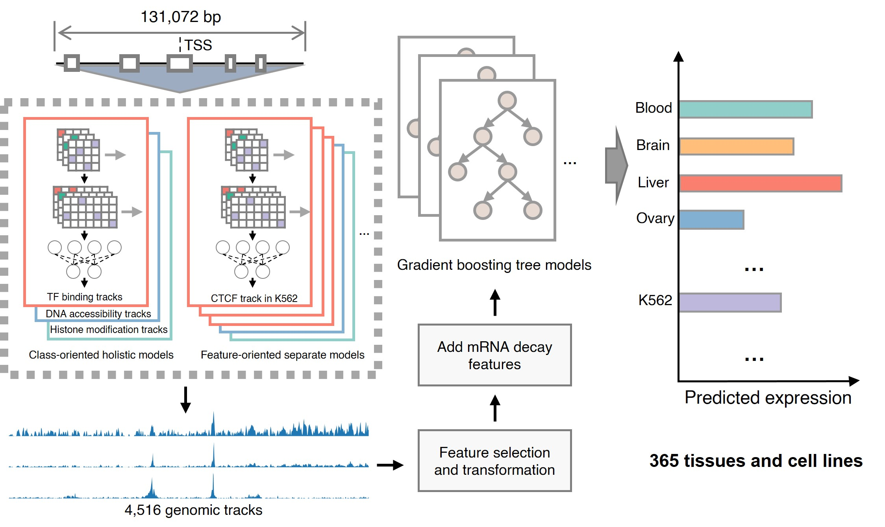

# SVEN
- [Installation](#installation)
- [Usage](#usage)
    - [Predict gene expression level based on TSS of genes](#predict-gene-expression-level-based-on-tss-of-genes)
    - [Predict effects of SVs on gene expression level](#predict-effects-of-svs-on-gene-expression-level)
    - [Predict functional effects of small noncoding variants](#predict-functional-effects-of-small-noncoding-variants)
- [Customize your own SVEN model](#customize-your-own-sven-model)
    - [Prepare sequences and get functional annotations](#1-prepare-sequences-and-get-functional-annotations)
    - [Transform functional annotations](#2-transform-functional-annotations)
    - [Train expression prediction models](#3-train-expression-prediction-models)

This repository contains code for SVEN, a multi-modality sequence-oriented <i>in silico</i> model, for quantifying genetic variants' regulatory impacts in over 350 tissues and cell lines.

The SVEN framework is described in the following manuscript: Yu Wang, Nan Liang and Ge Gao, [Quantifying the regulatory potential of genetic variants via a hybrid sequence-oriented model with SVEN](https://doi.org/10.1038/s41467-024-55392-7), <i>Nat. Commun.</i> <b>15</b>, 10917 (2024).



## Installation

> [!NOTE]
> Now we provide two modes for prediction: **_Full mode_** and **_Fast mode_**. For reproducing results from our manuscript, please use **_Full mode_**; otherwise, we recommend using **_Fast mode_** with negligible precision loss. 

Clone the repository then download and extract necessary resource files:
```bash
git clone https://github.com/gao-lab/SVEN.git
cd SVEN

# Download and extract resources and model parameters, default for fast mode
sh download_resources.sh # ~2G
# For full mode
sh download_resources.sh -m full # ~380G
```

We recommend using mamba or conda environment. Please check install instructions of mamba from https://github.com/mamba-org/mamba, Tensorflow from https://www.tensorflow.org/ and bedtools from https://bedtools.readthedocs.io/ for more details. 

```bash
# Create conda environment: sven
conda create -n sven python=3.10

# Activate conda environment
conda activate sven

# Install bedtools
conda install bioconda::bedtools

# Install tensorflow with cuda 12
pip3 install --user "tensorflow[and-cuda]"==2.16.1
# Or only install tensorflow
pip3 install tensorflow==2.16.1

# Install the other dependencies
pip3 install -r requirements.txt
```


## Usage

#### Predict gene expression level based on TSS of genes

```bash
# Process data and one-hot encoding
python prepare_data.py ./example/test_tss.txt
# OR get helps about prepare_data.py, the same below
python prepare_data.py -h

# Get functional annotations with CPUs in fast mode
python get_annotations.py
# OR get functional annotations with GPU 0 in full mode
python get_annotations.py --gpu 0 --mode full 

# Transform annotations in fast mode
python transform_annotations.py
# OR transform annotations in full mode
python transform_annotations.py --mode full

# Predict gene expression
python predict_expression.py # with all models
python predict_expression.py --target_idx 3 # with target model
python predict_expression.py --target_idx 3 --mode full # with full mode
```
Please check `./resources/cell_line_list.txt` for the correspondence between target_idx and cell line.
| Files and folders | Description |
| --- | --- |
| ```./example/test_tss.txt``` | Input TSS file. Columns: chromosome, position (1-based), strand, gene_name (gene_name should be list in ```"./resources/tss_gene_list.txt"```). |
| ```./work_dir``` | Default work folder. You can change it by --work_dir. |
| ```./work_dir/temp_bed``` | Processed bed file of input. | 
| ```./work_dir/temp.h5``` | One-hot encoded sequences of input. |
| ```./work_dir/annotations``` | Folder for predicted annotations. |
| ```./work_dir/annotations/transformed``` | Folder for transformed annotations. |
| ```./work_dir/output``` | Folder for output. |
| ```./work_dir/output/exp_tss.txt``` | Predicted gene expression level in target cell line (log10 scale). |

#### Predict effects of SVs on gene expression level
```bash
# Example in fast mode. If use full mode, please execute with "--mode full".
# Process data and one-hot encoding
python prepare_data.py ./example/test_sv.vcf --type sv

# Get functional annotations for ref seq and alt seq
python get_annotations.py --gpu 0 --type sv

# Transform annotations
python transform_annotations.py --type sv

# Predict gene expression
python predict_expression.py --type sv # with all models
python predict_expression.py --target_idx 3 --type sv # with target model
```
| Input file and output files | Description |
| --- | --- |
| ```./example/test_sv.vcf``` | Input SV file. Columns: chromosome, position (1-based), ref allele, alt allele, sv info. |
| ```./work_dir/output/exp_ref.txt``` | Predicted gene expression level for ref allele in target cell line (log10 scale). |
| ```./work_dir/output/exp_alt.txt``` | Predicted gene expression level for alt allele in target cell line (log10 scale). |
| ```./work_dir/output/exp_log2fc.txt``` | Predicted effects of SVs on gene expression level in target cell line (log2 fold change). |

#### Predict functional effects of small noncoding variants
```bash
# Process data and one-hot encoding
python prepare_data.py ./example/test_snv.vcf --type snv

# Get functional annotations for ref seq and alt seq
python get_annotations.py --gpu 0 --type snv
# With full mode and cpu
python get_annotations.py --type snv --mode full

# Calculate effects of small noncoding variants
python predict_effect.py # with optimal cutoff from REVA benchmark dataset
python predict_effect.py --cutoff 0.5 # with custom cutoff
```
| Input and output file | Description |
| --- | --- |
| ```./example/test_snv.vcf``` | Input small variant file. Columns: chromosome, position (1-based), ref allele, alt allele, variant info. |
| ```./work_dir/output/effect_snv.txt``` | Predicted effects of small noncoding variants. Column: effect size, label (based on given cutoff, 1 for functional variant and 0 for non-functional variant.) |


## Customize your own SVEN model
As a framework with high flexibility, you can customize your own SVEN models. 

Necessary files: Tss of genes ```./resources/tss_gene_list.txt```, corresponding mRNA decay features (or other features; if you want to use sequence only, you may not provide it) ```./resources/utr_features.txt``` and corresponding gene expression profile (example is the expression profile from 53 GTEx tissues)  ```./resources/gene_exp.txt```.
#### (1) Prepare sequences and get functional annotations.
```bash
# You can use our annotation module:
python prepare_data.py ./resources/tss_gene_list.txt
python get_annotations.py --gpu 0 # or with --mode full

# You can also use other tools to get annotations, such as Enformer:
# Check https://github.com/google-deepmind/deepmind-research/tree/master/enformer for more details about Enformer.
python prepare_data.py ./resources/tss_gene_list.txt --seq_len 393216
python custom_sven.py --action enformer_predict --enformer_path ENFORMER_MODEL_PATH
```
#### (2) Transform functional annotations.
```bash
# For our annotation module:
python transform_annotations.py # or with --mode full

# For Enformer annotations with custom decay_list:
python custom_sven.py --action enformer_transform --decay_list "0.01, 0.10, 0.20"
```
#### (3) Train expression prediction models.
Build-in models: XGBoost model and elasticNet. You can modify model's parameters in ```train_xgb() and train_elasticNet()``` or add more models in ```./sven/train.py```
```bash
# Train xgb model with default setting on first cell line/tissue in gene expression profile
python custom_sven.py --action exp_train --exp_id 0 # or with --mode full

# Train elasticNet model, including rRNA genes
python custom_sven.py --action exp_train --exp_id 0 --model_type elasticNet --ignore_rRNA false

# Train with Enformer annotation only, with custom performance cutoff, device and random seed 
python custom_sven.py --action exp_train --exp_id 0 --mode enformer --cutoff 0.6 --utr_features false --device gpu --seed 42
```

## Contact
Yu Wang: [wangy@mail.cbi.pku.edu.cn](mailto:wangy@mail.cbi.pku.edu.cn)
